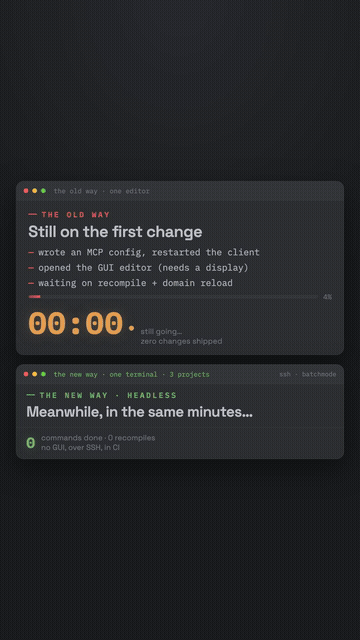

# unity-headless-cli-skill

[](https://github.com/Codeturion/unity-headless-cli-skill/releases)
[](https://github.com/Codeturion/unity-headless-cli-skill/stargazers)
[](https://github.com/Codeturion/unity-headless-cli-skill/network/members)
[](https://github.com/Codeturion/unity-headless-cli-skill/commits)
[](https://github.com/Codeturion/unity-headless-cli-skill/issues)
[](LICENSE)
[](https://unity.com)
[](#caveats)

A Claude Code plugin that sets up any Unity project to be driven **headless from the terminal**: no GUI editor, no MCP server. It adds the pipeline package, drops a reference doc into the project, and wires `CLAUDE.md` to point at it, so Claude (and you) can create GameObjects, add components, edit assets, run tests, and evaluate live C# over SSH, with 200 to 600 ms round trips and no recompile.

The heavy lifting is the Unity CLI plus its experimental `com.unity.pipeline` package. `unity command` and `unity command eval` *are* the tools; an agent with a terminal needs none of the MCP protocol.

<p align="center">
  
</p>
<p align="center"><a href="media/demo.mp4">Full-resolution video</a></p>

## Install (Claude Code)

```text
/plugin marketplace add Codeturion/unity-headless-cli-skill
/plugin install unity-headless-cli@unity-headless-cli-skill
```

Then, from inside your Unity project, run the skill (ask Claude to "set up headless Unity" or invoke `unity-headless-cli`). It will:

1. Resolve the project root (asks first).
2. Ensure the Unity CLI is installed (asks before installing anything machine level).
3. Add `com.unity.pipeline` to the project (`unity pipeline install`).
4. Write `docs/unity-cli-ref.md` into the project.
5. Create or append `CLAUDE.md` with a **Headless Unity CLI** section pointing at that doc.
6. Print the one manual step left: launch a `-batchmode` editor and leave it running.

Every step is idempotent, so re-running the skill is safe. After this, future Claude sessions in the project pick up the workflow automatically via `CLAUDE.md`.

> The plugin ships the skill and a bundled reference. It does not install Unity, the CLI, or a running editor for you; it drives and configures them. The skill asks before any install.

## What is in here

```text
.claude-plugin/
  marketplace.json          # marketplace entry (add via /plugin marketplace add)
  plugin.json               # plugin manifest
skills/unity-headless-cli/
  SKILL.md                  # the bootstrap-and-drive skill
  reference/unity-cli-ref.md# reference copied into <project>/docs on setup
examples/MyPipelineCommands.cs  # custom [CliCommand] sample, compile ready
scripts/install.sh          # standalone CLI installer (no Claude needed)
```

## Use it without Claude

You do not need the plugin to use the workflow. Install the CLI and drive an editor directly:

```bash
./scripts/install.sh /path/to/your/project      # installs CLI, adds the package
Unity -batchmode -projectpath <project> -logFile editor.log   # NO -quit
unity command create_gameobject --name Spawner --components Light --project-path <project>
unity command eval "return Application.unityVersion;" --project-path <project>
```

Full command surface, custom commands, automation contract, and gotchas: [`skills/unity-headless-cli/reference/unity-cli-ref.md`](skills/unity-headless-cli/reference/unity-cli-ref.md).

## Why this beats a GUI bridge

An agent with a terminal needs none of the MCP protocol. `unity command` / `unity command eval` *are* the tools. Same capability as a stdio MCP bridge, but no GUI to keep open, no window to render, works headless over SSH, and drops straight into CI. The same terminal drives any project with `--project-path`.

## How this relates to Unity's official skills

Unity publishes its own skill collection at [Unity-Technologies/skills](https://github.com/Unity-Technologies/skills). It is excellent, and its `unity-cli` skill documents the same CLI this repo uses, including the connected-editor surface (`unity pipeline`, `unity command`, `unity status`, `unity list`) in its advanced reference. If you want the full command reference maintained by Unity, use their skill.

This repo is not a competing reference. It is the workflow layer on top:

- **One-shot project bootstrap.** An idempotent skill that installs the CLI, adds `com.unity.pipeline`, drops the reference doc into your project, and wires `CLAUDE.md` so every future agent session picks the workflow up automatically. The official skills document commands; they do not set your project up to be agent-driven.
- **Persistent headless editor as the default mode.** The official docs describe talking to a running Editor. This repo is built around keeping a `-batchmode` editor alive on a remote machine with no GUI at all, driven over SSH, which is the setup that matters for build servers and working away from your desk.
- **The extras:** a compile-ready custom `[CliCommand]` example, a standalone installer script that needs no Claude, and a weekly docs-drift audit so the bundled reference does not silently rot.

Use both. Their skills for installs, builds, packages, and the authoritative command reference; this one to turn a project into something an agent drives headless.

## Security model

`eval` runs arbitrary C#, so it is worth being precise about what is exposed and by whom:

- The HTTP server and its bearer-token-gated `eval` are part of Unity's own `com.unity.pipeline` package, not something added by this repo. This skill only installs the package and documents how to use it.
- The pipeline server binds **localhost only**. Nothing listens on external interfaces; remote use goes through SSH to a shell on the machine, the same trust boundary as any other terminal access.
- Every request requires the bearer token the pipeline generates for the project. A process that has the token already has a shell as your user, at which point it does not need `eval` to run code.
- The skill itself never phones home, never fetches remote instructions at runtime, and asks before any machine-level install. The bundled reference doc is static and committed; the weekly docs audit only diffs upstream docs and opens an issue, it never edits or executes anything.

Treat the running editor like any other local dev server: keep it on machines you trust, behind SSH you trust.

## Caveats

- The CLI is beta and the package is experimental (`-exp`). Expect churn between versions.
- Stale Unity Hub keychain items can make every CLI command hang on an invisible GUI keychain prompt. Clear them if commands hang.
- `eval` runs arbitrary C# and is gated behind the pipeline server's localhost bearer token by design. See [Security model](#security-model).

## Keeping the reference honest

Unity's CLI docs change over time, so the bundled reference can drift. A weekly GitHub
Action (`.github/workflows/docs-audit.yml`, Mondays 08:00 UTC) re-fetches the official
reference and diffs it against a committed snapshot (`audit/unity-cli-reference.snapshot.md`).
If anything changed, it opens a `docs-drift` issue with the diff.

It only detects and notifies. It never edits the reference and never commits. When an
issue shows up, check the diff, update `docs/unity-cli-ref.md` if commands or flags moved,
then refresh the snapshot:

```bash
python3 audit/snapshot.py audit/unity-cli-reference.snapshot.md
```

## Docs

- Unity CLI reference: https://docs.unity.com/en-us/unity-cli/unity-cli-reference
- Pipeline package: https://docs.unity3d.com/Packages/com.unity.pipeline@0.3

## License

MIT. See [LICENSE](LICENSE).
